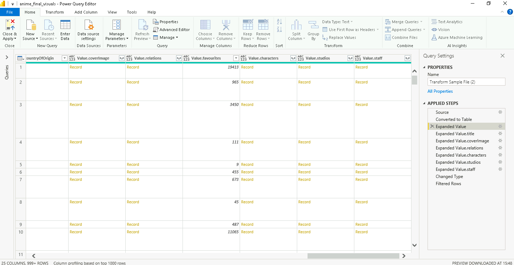

**ÉCOLE CENTRALE DE NANTES**

**Projet d'Application**

**RAPPORT**

**Sujet 6 : Conception d'un pipeline de manipulation de données au service des fans d'animation japonaise**

| Etudiants      |     | Encadrants    |     |
|----------------|-----|---------------|-----|
| Ahmad SAID     |     | Morgan Magnin |     |
| Rafael Vazquez |     | Tony Ribeiro  |     |

**2022 - 2023**

### REMERCIEMENTS

Nous tenons à exprimer nos sincères remerciements à nos encadrants, Morgan MAGNIN et Tony RIBEIRO qui nous ont accompagnés lors de ces 6 mois de ce projet. Leur expertise et leur guidance ont été inestimables tout au long du projet, et leur soutien a été essentiel pour nous aider à atteindre nos objectifs.

Leur engagement à notre égard et leur disponibilité ont été précieux, et nous avons été inspirés par leur passion pour l'animation japonaise et leur connaissance approfondie du domaine. Nous avons énormément appris de leur part et nous avons été très chanceux de pouvoir compter sur leur soutien et leur encouragement tout au long de ce projet passionnant.

Nous leur sommes profondément reconnaissants pour leur temps et leur énergie consacrés à notre projet et nous sommes convaincus que leur contribution a été déterminante dans la réussite de celui-ci. Nous leur sommes infiniment reconnaissants pour tout ce qu'ils ont fait pour nous et nous espérons pouvoir continuer à travailler avec eux à l'avenir. 

### Lexique

**API**

« Une API pour application programming interface permet à deux applications de communiquer entre elles. Elle permet de rendre disponibles les données ou les fonctionnalités d’une application existante afin que d’autres applications les utilisent. »[^1]

**GraphQL**

« GraphQL est un langage de requête et un environnement d'exécution côté serveur pour les interfaces de programmation d'applications (API) qui donnent la priorité aux clients exactement les données qu'ils demandent et rien de plus. »[^2]

**IDE**

“Un environnement de développement intégré, ou IDE, est un logiciel de création d'applications, qui rassemble des outils de développement fréquemment utilisés dans une seule interface utilisateur graphique (GUI).”[^3]

**Manga**

Un style de bandes dessinées et de romans graphiques japonais, généralement destiné aux adultes comme aux enfants.

**Anime**

Un style d'animation cinématographique et télévisuelle japonaise, généralement destiné aux adultes comme aux enfants.

# Sommaire
<!-- TOC start -->
- [Sommaire](#sommaire)
- [Table de figure](#table-de-figure)
- [Table de tableaux](#table-de-tableaux)
- [Chapitre I : Contexte du Projet](#chapitre-i-contexte-du-projet)
   * [Compréhension de AniList](#compréhension-de-anilist)
      + [**Home Page**](#home-page)
      + [**Profile**](#profile)
      + [**Anime & Manga Browse**](#anime-manga-browse)
   * [Conclusion ](#conclusion)
- [Chapitre II Méthodologie](#chapitre-ii-méthodologie)
   + [**Bibliothèque pandas**](#bibliothèque-pandas)
   + [**Bibliothèque Seaborn et Plotly**](#bibliothèque-seaborn-et-plotly)
   * [Présentation de l’API AniList](#présentation-de-lapi-anilist)
      + [**Documentation des requêtes**](#documentation-des-requêtes)
   * [Récupération des données](#récupération-des-données)
      + [**Traitement de données via AniList API**](#traitement-de-données-via-anilist-api)
      + [**Traitement local (JSON)**](#traitement-local-json)
   * [Conclusion](#conclusion-1)
- [Chapitre III Analyse de données](#chapitre-iii-analyse-de-données)
   * [Analyse avec Power Bi](#analyse-avec-power-bi)
      + [**Nettoyage et ajout de données pour l'analyse**](#nettoyage-et-ajout-de-données-pour-lanalyse)
      + [**Structure finale des données**](#structure-finale-des-données)
      + [**Fonctionnalités du Power BI** ](#fonctionnalités-du-power-bi)
         - [` `*Création de colonnes à partir des données insérées*](#-création-de-colonnes-à-partir-des-données-insérées)
      + [**Fonctionnalités Externe ajouté au PowerBI**](#fonctionnalités-externe-ajouté-au-powerbi)
      + [**Présentation des Tableaux de Bords et principales analyses**](#présentation-des-tableaux-de-bords-et-principales-analyses)
         - [*Regroupement des données disponibles pour l'analyse par rapport à chaque dossier*](#regroupement-des-données-disponibles-pour-lanalyse-par-rapport-à-chaque-dossier)
         - [*Représentation générale des informations relatives au personnel*](#représentation-générale-des-informations-relatives-au-personnel)
         - [*Analyse générale de tous les médias disponibles sur le site*](#analyse-générale-de-tous-les-médias-disponibles-sur-le-site)
         - [*Analyse spécifique d'un ou plusieurs médias*](#analyse-spécifique-dun-ou-plusieurs-médias)
         - [*Visualisation spécifique de tous les supports sous forme de tableau avec regroupement des données*](#visualisation-spécifique-de-tous-les-supports-sous-forme-de-tableau-avec-regroupement-des-données)
   * [Analyse en notebook](#analyse-en-notebook)
      + [**Corrélation du sexe des personnages avec leurs doubleurs**](#corrélation-du-sexe-des-personnages-avec-leurs-doubleurs)
      + [**Corrélation des âges des personnages avec leurs doubleurs**](#corrélation-des-âges-des-personnages-avec-leurs-doubleurs)
         - [*Préférence par âge de personnage*](#préférence-par-âge-de-personnage)
      + [**L'âge de l'équipe de travailleurs au moment du lancement d'un média**](#lâge-de-léquipe-de-travailleurs-au-moment-du-lancement-dun-média)
      + [**Conclusion**](#conclusion-2)
   * [Elaboration en web application interactive](#elaboration-en-web-application-interactive)
      + [**Présentation du bibliothèque Dash**](#présentation-du-bibliothèque-dash)
      + [**Graphe des équipes de travailles en fonction des séries**](#graphe-des-équipes-de-travailles-en-fonction-des-séries)
         - [*Graphe type 1: Nœuds Travailleurs uniquement*](#graphe-type-1-nuds-travailleurs-uniquement)
         - [*Graphe Type 2 :  Nœuds Travailleurs et Médias (Nœuds parents)*](#graphe-type-2-nuds-travailleurs-et-médias-nuds-parents)
         - [` `*Affichage d’un série complexe*](#-affichage-dun-série-complexe)
- [Difficultés rencontrées](#difficultés-rencontrées)
- [Conclusion](#conclusion-3)
<!-- TOC end -->

# Table de figure
[Figure 1 Objectifs Proposés par AniList	11](#_Toc123371292)

[Figure 2 Exemple de Home Page	12](#_Toc123371293)

[Figure 3 Exemple Page Profile (1)	13](#_Toc123371294)

[Figure 4 Exemple Page Profile (2)	13](#_Toc123371295)

[Figure 5 Anime Exemple	14](#_Toc123371296)

[Figure 6 Visualisation d’une DataFrame pandas dans un notebook	16](#_Toc123371297)

[Figure 7 Obtenir un média d'identifiant 231 ainsi que les personnages participant à partir d'une requête GraphQL.	17](#_Toc123371298)

[Figure 8 Description de l'attribut on mouse Hover	18](https://d.docs.live.net/4c04d69b6a1092d1/ECN_2nd_Year/Projet%20d'application/16.PAPPL-P6-SAID-VAZQUEZ_Rapport_final.docx#_Toc123371299)

[Figure 9 Auto-Complete Requête offert par GraphQL	18](https://d.docs.live.net/4c04d69b6a1092d1/ECN_2nd_Year/Projet%20d'application/16.PAPPL-P6-SAID-VAZQUEZ_Rapport_final.docx#_Toc123371300)

[Figure 10 Modèle Conceptuel de Données du AniList	19](#_Toc123371301)

[Figure 11 Diagramme de séquence : Accéder aux données d'AniList, les traiter et afficher les informations souhaitées.	20](#_Toc123371302)

[Figure 12 Diagramme de séquence : Sauvegarde de tous les données d'AniList en local	21](#_Toc123371303)

[Figure 13 Onglet d'édition des données	25](https://d.docs.live.net/4c04d69b6a1092d1/ECN_2nd_Year/Projet%20d'application/16.PAPPL-P6-SAID-VAZQUEZ_Rapport_final.docx#_Toc123371304)

[Figure 14 Exemple de transformations de fichiers avant et après traitement pour insertion dans PowerBI	26](#_Toc123371305)

[Figure 15 barre d'outils de transformation des données	26](#_Toc123371306)

[Figure 16 données finales traitées dans le tableau relatif aux détails des employés	27](#_Toc123371307)

[Figure 17 Organisation des relations entre les tables	28](#_Toc123371308)

[Figure 18 Exemple de Graphique généré par powerBI	29](#_Toc123371309)

[Figure 19 Formules et les résultats des colonnes créées à partir des informations saisies dans powerbi	30](#_Toc123371310)

[Figure 20 Exemple de graphe généré avec les filtres de forme, ponctuation et genre	31](#_Toc123371311)

[Figure 21 Graphe en sélectionnant seulement 3 médias	31](#_Toc123371312)

[Figure 22 Regroupement des données disponibles pour l'analyse par rapport à chaque dossier	33](#_Toc123371313)

[Figure 23 Analyse générale de tous les médias disponibles sur le site	34](#_Toc123371314)

[Figure 24 Analyse croisé Blood type X Gender	35](#_Toc123371315)

[Figure 25 Dashboard General pour analyse des médias	36](#_Toc123371316)

[Figure 26 Analyse spécifique des médias avec MeanScore de 100	37](#_Toc123371317)

[Figure 27 Dashboard pour analyse détaillé d'un media	38](#_Toc123371318)

[Figure 28 Analyse singulier de "One Piece"	39](#_Toc123371319)

[Figure 29 Dashboard avec des spécifications sur chaque media	39](#_Toc123371320)

[Figure 30 Exploitation spécifique des médias avec MeanScore > 70 et Durée > 60	40](#_Toc123371321)

[Figure 22 Groupe des personnage nées dans la même journée (29/12/2022)	41](#_Toc123371322)

[Figure 23: Nuage de points des personnages masculins doublés par des doubleurs féminins	42](#_Toc123371323)

[Figure 24 Répartition des personnages sur leurs mois de naissance	43](#_Toc123371324)

[Figure 25 Heatmap du tableau de contingence entre les mois de naissance des personnages et ceux des doubleurs	43](#_Toc123371325)

[Figure 26 Distribution des âges des personnages par rapport à ceux de leurs doubleurs	45](#_Toc123371326)

[Figure 27 écart-type des âges des doubleurs au sein de différentes équipes	46](#_Toc123371327)

[Figure 28 Graphe complexe et indéchiffrable des travailleurs d'une série japonaise	48](#_Toc123371328)

[Figure 29 Page initial Dash	49](#_Toc123371329)

[Figure 30 Graph du serie Ayakashi: Japanese Classic Horror	49](#_Toc123371330)

[Figure 31 Nœud Travailleur mis en évidence	50](#_Toc123371331)

[Figure 32 Graph du serie Ayakashi: Japanese Classic Horror avec les medias parents	51](#_Toc123371332)

[Figure 33 Nœud Media mis en evidence	52](#_Toc123371333)

[Figure 34 Plusieurs nœuds Travailleurs mis en évidence dans un media	52](#_Toc123371334)

[Figure 35 Graphe type 1 de la série "One Pièce" Travailleurs seulement	53](#_Toc123371335)

[Figure 36 Zoom au centre du  graphe type 1 de la série "One Pièce"	53](#_Toc123371336)

[Figure 37 Graphe type 2 de la série "One Pièce" Travailleurs Et Médias	54](#_Toc123371337)

[Figure 38 Zoom au centre du graphe type 2 de la série "One Pièce"	54](#_Toc123371338)

[Figure 39 Graphe type 2 de la série "One Pièce" après le filtrage	55](#_Toc123371339)
# Table de tableaux
[Tableau 1 Taille de donnes récupérés a partir l'API d''AniList	23](#_Toc123371340)

[Tableau 2 Contingence entre les sexes des personnages et leurs doubleurs	42](#_Toc123371341)

[Tableau 3 Exemple d'extraction de l'âge des personnages à partir des chaînes de caractères "character.age"	44](#_Toc123371342)

[Tableau 4 Moyennes et écarts-types des âges des doubleurs et des personnages	44](#_Toc123371343)

[Tableau 5 Résultat des travailleurs restants "One Pièce" après le filtrage	55](#_Toc123371344)

# Chapitre I : Contexte du Projet
   ## Données et travail attendu

|Titre:|Conception d'un pipeline de manipulation de données au service des fans d'animation japonaise|
| -: | :- |
|Lien :|<https://hippocampus.ec-nantes.fr/mod/data/view.php?d=51&mode=single&page=5> |
|Encadrant(s):|Morgan Magnin, Tony Ribeiro|
|Contexte, travail et résultats attendus:|
Le site internet Anilist.co offre un accès aux informations de plus de 500 000 anime et mangas, y compris les personnages, le staff et les données de diffusion en direct (chaîne de télévision au Japon, horaire de diffusion, etc.). 

Le site web fonctionne sur l'exploitation d'une API GraphQL ouverte qui permet de récupérer ces informations structurées en JSON via des requêtes.

On peut, avec une simple requête, récupérer la liste des noms des personnages d'un manga, les comédiens de doublage d'un anime, la liste des personnages doublés par une personne, etc.

En combinant les résultats de plusieurs requêtes, on peut faire des analyses intéressantes, notamment dans une perspective de "*data journalisme"* dans ce domaine :

- Constituer un graphe de relations entre les comédiens de doublage en fonction de la quantité d'anime dans lesquels ils ont fait du doublage ; 

- Mettre en relation le type d'anime et le studio l'ayant réalisé afin d'identifier des genres de prédilection ; 

- Faire une analyse de l'évolution des genres d'anime populaires au fil du temps

Le travail portera donc sur la collecte de données, leur structuration, leur analyse et visualisation.

La collecte se fera via l'API GraphQL d'Anilist.co sous forme de différentes requêtes ciblées.

Les données récupérées seront structurées sous forme de dataframe panda pour faciliter leur combinaison et analyse.

La visualisation se fera sous forme de graph via des bibliothèques python telles que seaborn, pyplot.

L'analyse pourra être enrichie en inter croisant les données de Anilist.co et d’autres plateformes telles que fandom.com / des données sémantiques de Wikipédia :

- Chercher par exemple si deux comédiens de doublage mariés ont doublé des personnages effectivement mariés dans la fiction ?

- le nombre de comédiens de doublage nés à Yokohama doublant des personnages d’une série se situant à Yokohama ?
|
|Environnement et technologies utilisées:|Notebook Python, API GraphQL, web sem, kaggle,|
|Bibliographie:|
- Anilist: [https://anilist.co](https://anilist.co/) 

- Anilist Api: <https://github.com/AniList/ApiV2-GraphQL-Docs>

- Web sémantique: <https://fr.wikipedia.org/wiki/Web_s%C3%A9mantique>

- Animint, site historique d’anime dont le compte Twitter publie chaque jour une liste sélective des anniversaires des personnages nés ce jour. <https://www.animint.com/blog/000988-questions-futiles-propos-des-publications-danniversaires-sur-compte-twitter-danimint.html>

- Cours Python/datasciences/machine learning de kaggle: <https://www.kaggle.com/learn>
|

## Compréhension de AniList
AniList est une plateforme en ligne accessible à l'adresse <https://anilist.co/> qui offre aux utilisateurs la possibilité de créer leur espace personnel dédié aux mangas et aux Animes. Selon sa page d'accueil, AniList vous permet de suivre, partager et découvrir de nouveau contenu en lien avec ces univers. Parmi ses fonctionnalités principales, on retrouve notamment la création de listes de médias déjà vu, le partage de contenu avec d'autres utilisateurs et la recommandation de nouvelles œuvres en fonction de vos goûts et de vos centres d'intérêt :

- **Suivi** - vous permet de créer une liste de votre contenu, avec des informations concernant le programme choisi et une analyse interconnectée entre les différents titres, liée aux catégories, au studio de création et autres.
- **Partage** - grâce à un système de fil d'actualités, obtenez et partagez des informations sur les sujets qui vous intéressent le plus dans l'environnement fermé des anime et des mangas. 
- **Découverte** - à partir des outils internes de la plateforme, découvrez des sujets nouveaux et tendances en fonction de vos préférences. En plus de l'accès aux critiques sur les productions pour prendre des décisions plus assertives

*Figure 1 Objectifs Proposés par AniList*

Nous présentons ci-dessous les principaux éléments présents sur la plate-forme ainsi qu'une brève description de ce que l'on peut trouver sur chacune des pages.

### **Home Page**
L'objectif de la page d'accueil est de rassembler les informations les plus importantes sur les affaires courantes.  Comme vous pouvez le voir dans la figure suivante, chaque section de la page est segmentée par un titre :

- **Activity** - C'est la partie principale de la page, elle montre au niveau global / followers toutes les activités qui sont enregistrées sur la plateforme par rapport aux anime vus. 
- **In Progress** - Fournit des informations sur les programmes qui sont regardés en ce moment par l'utilisateur. Donne des détails sur la progression des épisodes et le temps nécessaire pour finir de regarder l'anime. 
- **Forum Activity** - Affiche une recommandation de sujets de discussion et d'engagement des communautés. 
- **Content Recommendation** - Affiche une liste de programmes qui sont actuellement en vogue ainsi que des anime et manga qui ont été récemment ajoutés à la plate-forme.

*Figure 2 Exemple de Home Page*

### **Profile**
La partie Profil cherche à rassembler toutes les informations sur l'utilisateur. Dans cette partie, nous pouvons accéder à tous les enregistrements déjà saisis dans la plateforme ainsi qu'à un groupe de statistiques de tous les matériaux déjà consommés.

Dans la figure ci-dessous, nous voyons la page Overview, qui nous donne des informations sur notre activité dans AniList, ainsi que des informations globales sur le taux et le type de consommation de matériel.

*Figure 3 Exemple Page Profile (1)*

Dans la deuxième figure, nous voyons que le site nous permet déjà d'effectuer une analyse plus approfondie dans plusieurs catégories différentes, comme celles présentées à gauche de la figure. Ces données nous fournissent des informations importantes sur notre propre profil de consommation.

*Figure 4 Exemple Page Profile (2)*

### **Anime & Manga Browse**
La partie consacrée à la recherche d'animes et de mangas rassemble toutes les informations dont nous disposons sur les différents supports disponibles sur le site. 

En regardant la page d'un contenu spécifique, comme indiqué ci-dessous, nous pouvons nous faire une idée des données disponibles sur le site. Parmi elles, je retiens les informations relatives à l'équipe de production, aux personnages de l'anime et leurs doubleurs associés, aux détails sur la durée et la continuité et au classement de l'anime. 

*Figure 5 Anime Exemple*

## Conclusion 
A partir de la connaissance de base de la plateforme, nous pouvons enfin définir notre axe d'étude et les points centraux de notre analyse :

- Analyse de tendances à l'échelle mondiale : en utilisant les données de consommation d'anime et de manga de tous les utilisateurs d'AniList, nous souhaitons effectuer une analyse similaire à celle proposée par la plateforme, mais à une échelle plus large.
- Analyse des informations sur le personnel de production : grâce aux données sur le personnel ayant travaillé sur les différents médias proposés sur AniList, nous souhaitons extraire une analyse de ces informations pour mieux comprendre les forces et les dynamiques de chaque production.

Ces deux objectifs seront atteints en utilisant les données fournies par AniList et en menant une analyse approfondie de ces données.
# Chapitre II Méthodologie
   ## Environnement de travail
      ### **Python et Jupyter Notebook** 
			

Pour ce projet, nous avons dû apprendre à utiliser Python, un langage de programmation qui s'est révélé facile à comprendre et à utiliser. Il est particulièrement adapté à l'analyse de données grâce aux nombreuses librairies disponibles.

L'utilisation de notebooks Jupyter ou Kaggle offre une approche interactive et directe de la programmation. Au lieu d'avoir un environnement de développement intégré (IDE) et une console séparée, les notebooks sont constitués de cellules exécutables sur une seule page, ce qui permet de voir les résultats de chaque cellule immédiatement. En outre, les notebooks permettent d'utiliser le langage de mise en forme Markdown dans les cellules, ce qui rend le code plus lisible et facilite la présentation de résultats et de graphiques avec des explications structurées.

### **Bibliothèque pandas**

Parmi les bibliothèques de manipulation et d'analyse de données populaires en Python, on retrouve pandas. Les données sont organisées sous forme de tableaux à deux dimensions appelés DataFrames, qui comprennent des colonnes nommées et des ensembles de valeurs associés appelés séries. Les DataFrames peuvent être exportés au format JSON ou CSV pour être utilisés dans d'autres logiciels ou contextes.

Pandas offre de nombreux avantages pour la manipulation et l'analyse de données. Il est facile de travailler avec des DataFrames, même s'ils contiennent des valeurs manquantes, grâce à l'ensemble de fonctions disponibles dans la bibliothèque. Ces fonctions permettent de filtrer les données en fonction de conditions sur les lignes et/ou les colonnes, de supprimer des lignes ou des colonnes, d'ajouter de nouvelles lignes ou colonnes, de sélectionner des valeurs spécifiques, de fusionner des données, etc. En utilisant ces fonctions, il est possible de facilement manipuler et transformer des données en vue de les analyser ou de les présenter de manière claire et informative.

*Figure 6 Visualisation d’une DataFrame pandas dans un notebook*

### **Bibliothèque Seaborn et Plotly**
 

Seaborn est une bibliothèque de tracé de graphiques statistiques pour Python qui s'appuie sur Matplotlib. Elle offre une interface simplifiée pour tracer de nombreux types de graphiques couramment utilisés en statistiques, avec un look and feel esthétique par défaut. Seaborn facilite grandement la création de graphiques de qualité professionnelle en Python.

Plotly est une autre bibliothèque de tracé de graphiques pour Python qui permet de créer des graphiques interactifs de haute qualité. Elle est également facile à utiliser et offre la possibilité de créer des tableaux de bord esthétiques et informatifs en utilisant la bibliothèque Dash. Cependant, Plotly offre également de nombreuses ressources pour créer des graphiques plus complexes et informatifs, ce qui en fait une option polyvalente pour la visualisation de données.
## Présentation de l’API AniList
   ### **GraphQL API**
GraphQL est un langage de requête qui permet d'accéder et de manipuler des données stockées dans une base de données ou une autre source de données. Il permet aux clients de demander des données spécifiques à un serveur, plutôt que de recevoir un ensemble prédéfini de données. Cela permet aux clients d’obtenir exactement les données dont ils ont besoin, dans le format dont ils ont besoin, sans avoir à demander plus ou moins de données qu'ils n'en ont besoin.

L'API AniList utilise GraphQL pour permettre aux développeurs d'accéder aux données sur les anime, les manga et d'autres contenus liés à l'industrie de l'anime et du manga. Avec l'API AniList, vous pouvez utiliser GraphQL pour faire des demandes de données spécifiques sur les titres d'anime et de manga, les personnages, les producteurs et autres données. Vous pouvez également utiliser GraphQL pour créer et mettre à jour des listes d'anime et de manga que vous avez regardé ou que vous comptez regarder, et pour obtenir des recommandations sur de nouveaux anime et manga en fonction de vos préférences.

*Figure 7 Obtenir un média d'identifiant 231 ainsi que les personnages participant à partir d'une requête GraphQL.[^4]*

### **Documentation des requêtes**
La documentation de l'API AniList est une ressource complète qui fournit des informations sur l'utilisation de l'API pour accéder et manipuler les données liées aux anime et aux manga. La documentation comprend des informations sur les points de terminaison de l'API, l'authentification et les limites de débit, ainsi que des descriptions détaillées des données disponibles via l'API.

Pour accéder à la documentation de l'API AniList, vous pouvez visiter la page web suivante : 

<https://anilist.gitbook.io/anilist-apiv2-docs/>

Sur cette page, vous trouverez une gamme de ressources, notamment un guide de démarrage, une liste de points de terminaison de l'API et des informations détaillées sur les données disponibles via l'API. Vous pouvez également trouver des exemples d'utilisation de l'API pour faire des demandes de données, ainsi que des informations sur l'authentification de vos demandes API et sur la gestion des erreurs.

En plus de la documentation de l'API, le site web AniList propose également une gamme d'autres ressources, notamment un forum pour les développeurs et un dépôt GitHub avec des exemples de code et d'autres ressources. Ces dernières peuvent être utiles si vous avez besoin d'aide supplémentaire ou de guidance lors de l'utilisation de l'API AniList.

Exemple de documentation interactive avec l’outil <https://anilist.co/graphiql>:

*Figure 8 Auto-Complete Requête offert par GraphQL*

*Figure 9 Description de l'attribut on mouse Hover*

## Récupération des données
   ### **Model conceptuel des données**
Afin de mieux comprendre les données qu’on va récupérer de AniList et leurs analyses. On a pu construire un modèle conceptuel de données minimal en se basant sur les connections « edges » existants dans les entités récupérées par GraphQL: 

<https://anilist.gitbook.io/anilist-apiv2-docs/overview/graphql/connections>.

*Figure 10 Modèle Conceptuel de Données du AniList*

Remarques :

- ***Media***: Les médias peuvent être des anime ou des manga (des dessins animés japonais).
- « relate to » : Les médias sont souvent liés à d'autres médias qui forment une série avec les mêmes personnages et différentes histoires.
- « produced in » : Plusieurs studios peuvent contribuer à la production d'un même média.

- ***Character*** (fictif) désignant les personnages animés pouvant apparaître dans un ou plusieurs médias.
- « dubbing artist » : Le ***Staff*** (des êtres humains) peut être un acteur de doublage pour un ou plusieurs personnages animés.
- « produced by » : Le ***Staff***  peut être un artiste de manga, un auteur, artiste de son, montage… qui participe à la production d'un média.

### **Traitement de données via AniList API**

*Figure 11 Diagramme de séquence : Accéder aux données d'AniList, les traiter et afficher les informations souhaitées.*

- **Requête GraphQL:** Lorsqu’une application envoie une requête API à un serveur, le serveur analyse la requête, exécute la requête en accédant aux données ou aux services nécessaires, génère une réponse, et envoie cette réponse à l'application.

- **Transformation DataFrame** : Il est possible de transformer des données au format JSON en un DataFrame Pandas, qui est une structure de données tabulaire utilisée pour stocker et manipuler des données de manière structurée.

- **Visualisation Graphique** : Une fois que les données sont stockées dans un DataFrame Pandas, on peut utiliser la bibliothèque de visualisation de données Seaborn pour générer des visualisations à partir de ces données.

### **Traitement local (JSON)**

*Figure 12 Diagramme de séquence : Sauvegarde de tous les données d'AniList en local*

Comme l'API proposée par AniList est limitée en termes de fonctionnalités de filtrage des données, nous avons également proposé de récupérer toutes les données de l'API et de les filtrer localement plutôt que de le faire sur le serveur.

Bien que cette approche soit plus coûteuse que celle consistant à filtrer côté serveur, elle offre beaucoup plus de possibilités de manipulation de données et de liberté de traitement. Elle nous permet également de ne pas avoir besoin d'être connectés à internet pour fonctionner.

Toutefois, il y a deux contraintes à prendre en compte : 

- La taille de chaque requête HTTP, qui ne peut retourner qu'un nombre limité d'éléments
- Et le nombre de requêtes autorisées par minute sur l'API pour éviter les requêtes exhaustives. 

Pour contourner ces contraintes, nous avons utilisé la pagination pour récupérer les données progressivement (boucle interne) et nous avons mis en place une pause de 100 secondes entre chaque série de 80 requêtes (boucle externe). Le choix de ces nombres a été effectué après plusieurs essais manuels tout en évitant le blocage du serveur.
## Conclusion
En conclusion, nous avons bien compris les données fournies par l'API d'AniList et nous avons mis en place un algorithme pour récupérer ces données en ligne ou en local. Nous sommes maintenant prêts à passer à l'analyse de ces données dans le chapitre suivant. Nous avons les outils et les connaissances nécessaires pour traiter ces données de manière efficace et en extraire des insights pertinents. Nous sommes impatients de poursuivre notre travail et de partager nos résultats avec vous. 

# Chapitre III Analyse de données
   ## Stratégie d’analyse
Pour récupérer les données, nous avons téléchargé toutes les informations possibles de chaque entité présente dans le modèle conceptuel des données (voir la section 2.3.1). Selon le diagramme de séquence du traitement local (section 2.3.3), nous avons suivi ce processus pour obtenir les données nécessaires. Nous avons également traduit les relations "one to many" et "many to many" avec l'ID de la relation seulement afin de pouvoir établir les relations plus tard si besoin.

Données obtenues le 12/10/2022 :

|**Source**|**Nombre de Records**|**Taille Fichier**|
| :- | :- | :- |
|**Staff**|120 845|136 MB|
|**Character**|126 310|87 MB|
|**Media**|102 273|105 MB|
|**Studio**|1923|536 KB|
*Tableau 1 Taille de donnes récupérés a partir l'API d''AniList*

Après avoir obtenu les données, nous utiliserons **Power BI** pour les visualiser en raison de sa rapidité et de son efficacité pour comprendre ces données. Si nous sommes intéressés par des graphiques spécifiques, nous les traduirons en **Notebook Python** pour plus de contrôle. Si le dernier ne permet pas l'interactivité souhaitée, nous les traduirons en une **application web Dash**. Ces trois méthodes de visualisation seront expliquées en détail dans ce chapitre.

## Analyse avec Power Bi
En dépit de la puissance analytique et de la richesse des visuels générés par Python à l'aide des bibliothèques de traçage de graphiques, nous avons décidé de commencer notre analyse en utilisant PowerBI.

Power BI est un outil de Business Intelligence (BI) proposé par Microsoft qui offre des analyses de haut niveau en temps réel, des modélisations étendues et un développement totalement personnalisé. Il a été pionnier dans le but de rendre l'analyse commerciale plus efficace grâce à des services intuitifs, interactifs et faciles à utiliser. 

Power Bi est également une plateforme Low-code, ce qui signifie qu'elle vise à rendre possible la production d'applications robustes qui soutiennent et font progresser votre analyse tout en écrivant peu ou pas de code. En plus de simplifier le processus de développement d'applications, ces plateformes améliorent les processus, offrent une automatisation aisée du flux de travail et fournissent de nombreuses autres fonctionnalités utiles qui permettent d'obtenir de meilleurs résultats. Cette plateforme nous a semblé la meilleure pour effectuer l'analyse initiale pour quelques raisons distinctes : 

**Facilité d'insertion et de connexion des données :**

Power Bi dispose d'un outil interne dédié uniquement au traitement et au nettoyage des données avant leur insertion dans le tableau de bord, permettant aux données d'être en ordre au moment de leur utilisation. En outre, après cette étape, nous sommes amenés à effectuer la création de liens entre les données d'une manière très simple, en suivant la même idée de liaison de base de données, en indiquant les clés de connexion entre plusieurs tables, et à partir de cela le lien entre toutes les tables sont ajoutées automatiquement.

**Rapidité à créer des visuels :** 

Comme notre projet est fondé sur une analyse exploratoire des données, pour pouvoir créer des graphiques significatifs, nous devions effectuer de nombreux tests jusqu'à ce que nous obtenions des informations pertinentes. Comme PowerBi fonctionne selon le schéma "drag and drop" en utilisant des blocs pour pouvoir créer des visuels, il facilite la définition des paramètres, accélérant la création de visuels afin que nous puissions définir notre angle d'analyse de manière plus assertive.

**Création de visuels interactifs et interconnecté :** 

Un avantage significatif de Power Bi est également lié à la malléabilité des visuels créés. Une fois les paramètres définis, des filtres peuvent être ajoutés à la page du tableau de bord afin que l'utilisateur puisse modifier les visualisations à sa convenance. En outre, même s'il n'y a pas de filtres sur la page, un tableau de bord avec plusieurs visuels est également interactif, Power Bi permet également d'utiliser un graphique/visuel comme entrée pour filtrer un autre visuel.
### **Nettoyage et ajout de données pour l'analyse**
Pour insérer les données à traiter dans Power Bi, nous avons opté pour l'insertion des fichiers au format JSON en divisant le fichier original en plusieurs petits fichiers. 

Nous avons opté pour ce type d'approche car si nous ajoutons en une seule fois le fichier comportant plus de 126 000 lignes et plusieurs colonnes, il serait très pénible pour Power BI d'effectuer son analyse et son chargement. Ce que nous avons fait, c'est insérer un fichier modèle et le traiter de manière à ce que le système puisse comprendre comment comprendre les autres fichiers et simplement reproduire les étapes données pour le premier petit fichier, réduisant ainsi le besoin de traitement et permettant l'ajout de toutes les données.

Toutes ces étapes ont été réalisées dans l'environnement du Power Query Editor, un outil interne développé par Microsoft pour modifier ou transformer les fichiers de données avant qu'ils ne soient chargés dans le tableau de bord Power BI. L'éditeur de requêtes sert de conteneur de données intermédiaire qui vous permet de modifier les données en choisissant les colonnes et les lignes, en faisant pivoter et en dépivotant les colonnes, en divisant les colonnes et les lignes, etc.

*Figure 13 Onglet d'édition des données*

Les fichiers marqués avec "Transform Files" sont utilisés pour définir le modèle de transformation des fichiers comme expliqué ci-dessus. 

Ci-dessous, regroupés dans le dossier "Other Queries", nous avons tous les tableaux résultants de l'application des sample files à la jointure de toutes les petites archives.

L'avantage d'effectuer des modifications dans cet environnement est que nous ne chargeons qu'un aperçu des résultats, de sorte que nous n'avons pas besoin d'accéder à une lourde charge de données pour pouvoir effectuer les ajustements nécessaires.

Remarque : lorsque nous chargeons les données de Power Query Editor dans PowerBI, seules les données du dossier "Other Queries" sont transmises.

Vous trouverez ci-dessous un exemple de fichier JSON traité pour le fichier lié aux médias. Comme principale transformation, nous voyons la réduction de 25 colonnes à seulement 18 colonnes tout en ne gardant que les données les plus pertinentes et les identifiants uniques pour l'analyse graphique. 

En plus de cela, nous avons également réduit la densité des données, car comme on peut le voir, les colonnes qui avaient des fichiers au format "record" sont devenues de simples valeurs. Ceci est dû au décloisonnement effectué, puisque la relation entre les différentes entités dans AniList se fait par "nœuds", seules les valeurs essentielles ont été extraites.

*Figure 14 Exemple de transformations de fichiers avant et après traitement pour insertion dans PowerBI*

Le cas ci-dessus n'était qu'un simple exemple, mais Power Query nous fournit de puissants outils de transformation des données, comme indiqué ci-dessous.

*Figure 15 barre d'outils de transformation des données*

Cet onglet nous permet d'effectuer différentes manipulations des données, depuis des changements complets dans le tableau regroupant un ensemble de données, jusqu'à des changements dans les informations de la colonne elle-même afin que les données soient nettoyées et puissent être utilisées pour l'analyse ou même des transformations plus complexes. Par exemple, la figure suivante montre trois colonnes qui ont été créées et une qui a été manipulée à l'aide des outils de transformation de colonnes.

- **Blood Type** - le problème de cette colonne est que nous avons eu de petites variations dans la saisie des données qui ont permis de classer la même information en plusieurs types. Par exemple, le groupe sanguin A peut être représenté par : A, A+, A + et Type A. Ensuite, des étapes ont été appliquées pour transformer toutes les variations uniquement en A.
- **Height** - Cette information a été extraite de la colonne description qui, pour ne pas être paramétrée et contenir trop d'informations disparates, n'a pas pu être analysée. Cependant, on a remarqué que pour les informations relatives à la hauteur, les données suivaient plus ou moins le même formatage. Ces informations ont donc été extraites, puis il a également fallu convertir les données dans la même unité.

- **Hometown.City et Hometown.Country** - Ces informations ont été extraites d'un champ unique qui a recueilli les informations de localisation de chaque employé, malgré les efforts pour effectuer le traitement de ces données, en raison de l'absence de norme dans l'insertion des données, les informations sur chacune de ces données ne peuvent pas être complètement fiable

*Figure 16 données finales traitées dans le tableau relatif aux détails des employés*

### **Structure finale des données**
Une fois que toutes les données ont été ajoutées et traitées dans l'éditeur Power Query, nous avons importé ces données dans PowerBi et construit les relations entre les fichiers.

*Figure 17 Organisation des relations entre les tables*

L'élément important à souligner dans cette figure est l'existence de tables intermédiaires entre les tables d'identification des personnages, des médias et des personnels. Nous avons pris cette décision afin que les tableaux initiaux ne comportent que des informations uniques et que nous puissions travailler avec les tableaux les plus compressés possible.

### **Fonctionnalités du Power BI** 
   #### *Création simple des graphiques*
En tant que Low Code Platform, le principal atout de Power BI est qu'elle nous permet de créer rapidement et facilement des visuels afin de comprendre les données que nous traitons. Cela signifie qu'avec de simples clics, nous pouvons pratiquement visualiser la relation entre plusieurs catégories dans notre ensemble de données.

Par exemple, si nous voulons visualiser la quantité de médias diffusés au fil du temps, une succession de 3 simples clics suffira pour obtenir ce résultat :

Sélectionnez le visuel du graphique à barres (ou autre de votre choix);
Sélectionner les valeurs comme les identifiants recherchés (dans ce cas id\_media);
Définir comme axe la date du communiqué de presse.

Ensuite, powerbi génère automatiquement le graphique dans le meilleur format possible.

Remarque: PowerBI nous donné aussi la possibilité d'ajouter une légende (comme le Hue dans Python) qui nous permet d'ajouter encore plus d'informations à la visualisation.

Remarque 2: Pour obtenir la ligne de tendance en jeûne il faut juste aller dans le button de la loupe et la rendre activée.

*Figure 18 Exemple de Graphique généré par powerBI*
#### ` `*Création de colonnes à partir des données insérées*
Un autre avantage de powerbi est lié à la facilité de manipulation des données. Une fois chargées, nous pouvons effectuer des opérations simples de classification ou transformer l'information en utilisant des méthodes préétablies dans la plateforme.

Dans la figure ci-dessous, il y a quatre colonnes qui ont été créées en utilisant cette fonctionnalité, puis, pour rendre la création des tableaux plus compréhensible, il y a des exemples de codes pour les calculs de chaque colonne.

*Figure 19 Formules et les résultats des colonnes créées à partir des informations saisies dans powerbi*

### **Fonctionnalités Externe ajouté au PowerBI**
Comme le suggèrent nos encadrants, nous avons également essayé de réaliser une visualisation en graphes pour montrer l'existence éventuelle de membres du personnel (plus précisément les acteurs vocaux) qui ont joué dans plus d'un Anime. 

Ainsi, pour y parvenir dans PowerBi, nous devons recourir à des formes de visualisation externes aux standards fournis par la plateforme. Outre le fait que PowerBi est une plateforme qui permet de nombreuses analyses, elle dispose également d'une Offre interne de microsoft où de nombreux autres types de visualisation peuvent être explorés pour obtenir des visualisations spécifiques.

Pour tester le type de conclusions que nous étions en mesure de créer, nous avons décidé d'analyser tous les médias au format télévisuel, dont le classement se situait entre 70 et 100 et qui appartenaient au genre de l'action, pour voir si un acteur se répétait.

Nous sommes arrivés à quelques noms qui apparaissent avec une certaine fréquence. et si nous voulons nous pouvons cliquer sur le nom de la personne elle-même pour savoir en détail à quel programme elle a participé, comme c'est le cas de justin cook, sélectionné dans l'exemple.

*Figure 20 Exemple de graphe généré avec les filtres de forme, ponctuation et genre*

Un autre cas d'utilisation serait d'analyser certains programmes spécifiques qui nous intéressent. Par exemple, nous avons sélectionné Naruto, one piece et dragon ball au format télévision pour comprendre quelles relations pourraient apparaître. 

D'après le graphe et le tableau de support, nous pouvons voir qu'il n'y a pas beaucoup de relations entre Naruto et les deux autres séries, mais nous pouvons voir que certains doubleurs sont à la fois dans one piece et dragon ball.

*Figure 21 Graphe en sélectionnant seulement 3 médias*

### **Présentation des Tableaux de Bords et principales analyses**
Bien que PowerBi nous permette d'effectuer une variété d'analyses, son plus grand atout est sa flexibilité et la possibilité de créer des tableaux de bord. De cette façon, nous ne sommes pas limités à des analyses uniques et nous permettons également à un plus grand nombre de personnes d'avoir accès aux données et aux graphiques, afin de créer de nouvelles perspectives et de nouvelles combinaisons de données. 

Ainsi, pour ce projet, outre le tableau déjà présenté en relation avec le graphique, nous en avons construit d'autres pour l'exploration de données spécifiques :

Regroupement des données disponibles pour l'analyse par rapport à chaque dossier
Représentation générale des informations relatives au personnel
Analyse générale de tous les médias disponibles sur le site
Analyse spécifique d'un ou plusieurs médias
Visualisation spécifique de tous les supports sous forme de tableau avec regroupement des données
Visualisation de graphes (déjà présenté)

#### *Regroupement des données disponibles pour l'analyse par rapport à chaque dossier*
Le premier tableau de bord construit a permis de comprendre la disponibilité et la représentativité des analyses effectuées sur chaque information. 

Comme les données de AniList peuvent être saisies par le public lui-même, il n'y a aucune certitude qu'elles soient remplies complètement ou correctement, c'est pourquoi cette page donne des informations sur la représentativité des données.Voici quelques conclusions concernant les données de chacun des fichiers extraits :

**Characters** : Pour les personnages, les deux informations les plus importantes sont les deux dernières, car nous pouvons voir que seulement 1/3 des personnages ont leur sexe affiché et que seulement 10% ont des informations sur leur âge.
**Media** : Pour les médias, nous constatons que les données sont mieux distribuées, les seules données qui représentent une distribution moins fiable sont celles relatives à l'année et à la saison de sortie, avec seulement 10% des données renseignées. L'information sur le score moyen, bien qu'un peu incomplète, est plus fiable car elle est présente dans plus de 80% des contenus.
**Staff** : En analysant les données concernant les agents, nous avons réalisé que la plupart d'entre eux n'ont pas été insérés dans la plate-forme et que notre analyse sera probablement sous-représentée. Malgré cela, les informations ont été formatées de telle sorte que si les données sont éventuellement complétées dans la plate-forme, il suffira de modifier les fichiers de référence powerbi pour que les nouvelles informations puissent être insérées.

*Figure 22 Regroupement des données disponibles pour l'analyse par rapport à chaque dossier*

#### *Représentation générale des informations relatives au personnel*
Le deuxième tableau vise à présenter de manière synthétique les informations contenues dans le tableau des effectifs. Nous y présentons des visuels différents :

Carte indiquant l'emplacement de tous les employés victimes de discrimination sexuelle.
Tableau de Camembert avec les 10 principales professions du personnel
Présentation de tout le personnel avec l'âge et les années de travail
Concentration du personnel par pays
Des diagrammes à barres représentant des données sur les naissances et les décès, ainsi que sur la répartition sanguine et le sexe.
Moyenne des indicateurs principaux des employés.

*Figure 23 Analyse générale de tous les médias disponibles sur le site*

Déjà à partir de cette première présentation, nous pouvons tirer quelques conclusions intéressantes sur les informations moyennes des principaux facteurs, comme par exemple l'âge moyen des employés de la plateforme est de 52 ans, et la moyenne des années d'activité est de 28 ans. 

Par ailleurs, nous avons vu que plus de 50 % des employés travaillent en tant qu'acteurs vocaux et que la deuxième profession la plus reconnue est celle de mangaka. Nous avons également remarqué que la répartition des employés entre les sexes n'est pas si grande, mais nous constatons qu'il y a une plus grande prévalence de femmes parmi les employés. 

D'autre part, il est également intéressant de noter que le groupe sanguin le plus courant chez les employés est le groupe A, ce qui montre une tendance dans nos données. Bien que le groupe sanguin le plus courant dans le monde soit le groupe O, comme la plupart de nos données proviennent d'employés au Japon, nous pouvons constater que la distribution du sang suit la même tendance qu'au Japon. Au Japon, 40% des personnes sont du groupe sanguin A, 30% du groupe sanguin O, 20% du groupe sanguin B et 10% du groupe sanguin AB.

L'une des analyses croisées que nous avons effectuées est représentée ci-dessous et consistait à voir s'il y avait une grande différence dans la répartition des sexes concernant les groupes sanguins. La conclusion à laquelle nous sommes parvenus est que pour la plupart des groupes sanguins, la répartition était stable, mais que seul le groupe B a connu un léger changement dans la répartition.

*Figure 24 Analyse croisé Blood type X Gender*
#### *Analyse générale de tous les médias disponibles sur le site*
Ce graphique, bien que très complexe, est celui qui nous fournit le plus d'informations sur les contenus disponibles dans AniList. Il nous permet de regrouper les données de plus de 120 000 productions disponibles sur la plateforme et, grâce à la puissance du powerbi, nous pouvons effectuer des analyses de corrélation entre différents paramètres. 

Sur cette page, nous avons comme données principales les facteurs de caractérisation des différents médias dans les graphiques en bas de page. Sur le côté droit, nous avons des informations sur la saison de diffusion et le score de tous les médias afin de pouvoir évaluer et créer des relations à partir de toutes les données disponibles sur la plateforme. Sur ce tableau de bord, nous obtenons des informations très spécifiques sur le type de contenu qui est disponible sur la page, par exemple : 

- 85% du contenu publié est déjà terminé et 14% est toujours en cours de réalisation
- 82% sont des mangas, ce qui signifie que la plupart des contenus du site sont encore des bandes dessinées.
  - Dans cette classification, pour les anime, on constate que 23% sont des séries TV, 20% des OVA et 19% des films. Pour la catégorie Manga, nous constatons que 77% sont en fait des Manga.
- 37 % des personnages sont considérés comme des personnages principaux, tandis que les autres 60 % sont des personnages de soutien.
- 91% du contenu est produit au Japon
- 23% contient des informations destinées aux adultes
- En ce qui concerne le moment de l'année où il est diffusé, on constate qu'il est distribué tout au long de l'année, mais qu'il y a une légère préférence pour les contenus diffusés en automne et au printemps. 
- La note moyenne sur la plateforme est de 67 (sur un maximum de 100) et l'écart-type est de 13, ce qui montre une variation peu significative.
- Nous constatons également que le nombre d'articles produits par an a tendance à augmenter depuis 1989, mais que le pic a été atteint en 2016 avec 563 articles produits cette année-là. 
- De plus, nous constatons que l'évaluation moyenne suit une distribution unimodal avec des pics majeurs dans les dizaines et des pics secondaires dans les multiples de 5
- Les 4 genres les plus présents sur la plateforme, totalisant 50% du contenu sont : la romance, la comédie, le drame et le Hentai.
- De plus, 80% des contenus de la plateforme ont une durée comprise entre 20 et 30 minutes par épisode
- En ce qui concerne le sexe des personnages, nous constatons que la majorité n'a pas cette donnée sur le site, mais que parmi ceux qui l'ont, il y a une distribution très égale d'environ 15% pour chaque sexe.

*Figure 25 Dashboard General pour analyse des médias*

En outre, comme analyse spécifique, nous avons essayé de comprendre plus en détail certaines caractéristiques des contenus qui ont obtenu un score de 100 dans la plateforme. Au total, nous avons 802 médias qui ont obtenu le score maximum et les conclusions que nous avons tirées sont les suivantes :

- Tous les médias sont des mangas, donc ils n'ont pas de version audiovisuelle.
- En approfondissant la question, nous constatons que la prépondérance est toujours accordée aux mangas, mais que le format Novel commence à gagner en importance, étant présent dans 17 % des médias.
- En ce qui concerne le sexe des personnages, nous constatons qu'il reste très similaire, avec toutefois une légère prépondérance du sexe féminin.
- Par rapport à la moyenne, on constate une présence plus importante des personnages principaux, 54 % contre 27%, ce qui peut signifier une plus grande préférence pour les univers de personnages plus simples.
- Autre changement, la représentation des contenus pour adultes est beaucoup plus importante, puisqu'elle est de 45%.
- En outre, conformément aux informations ci-dessus, nous constatons un changement important dans les genres de médias, puisque sur les 802 médias classés 100, 349 sont au moins classés comme Hentai, suivis par la romance, la comédie et le drame.

*Figure 26 Analyse spécifique des médias avec MeanScore de 100*
#### *Analyse spécifique d'un ou plusieurs médias*
Le graphique suivant présente certaines informations déjà vues dans le précédent mais inclut également de nouvelles données concernant le personnel et les studios. Ainsi, le but de cette visualisation est de présenter les données les plus pertinentes de la meilleure façon possible en interconnectant les 3 fichiers de données disponibles.

Ainsi, bien que nous puissions effectuer une analyse générale de tous les anime, l'objectif principal dans ce cas est de pouvoir visualiser des informations groupées du même média, ou la comparaison de quelques médias.

*Figure 27 Dashboard pour analyse détaillé d'un media*

Pour illustrer l'analyse réelle qui pourrait être faite, nous avons sélectionné un des contenus produits sur le nom de « One Piece », à partir des informations affichées, nous pouvons obtenir quelques informations intéressantes :

- L’âge moyen des personnages est beaucoup plus jeune que celui des personnes qui ont produit l'anime.
- S’il s'agit d'un matériel de type anime, la plupart des employés sont des acteurs de voix
- Près de 70% du personnel et 80% des personnages sont des hommes
- La série est sortie en 1999 et a un score moyen de 87
- Bien que la qualité des données ne soit pas parfaite, nous pouvons constater que les travailleurs de l'anime ont des origines bien définies, puisque près de la moitié d'entre eux viennent du Japon et l'autre moitié des États-Unis, ce qui se reflète également dans la langue qu'ils parlent.
- En ce qui concerne le mois de naissance, nous constatons également qu'il n'y a pas de tendance, la distribution étant homogène tout au long des mois. 

*Figure 28 Analyse singulier de "One Piece"*
#### *Visualisation spécifique de tous les supports sous forme de tableau avec regroupement des données*
En tant que dernière visualisation, nous présentons également une information groupée sur les médias sous forme de tableau. Tout comme le dernier tableau de bord présenté, celui-ci cherche une vue plus spécifique en montrant les détails de médias spécifiques. Les mêmes filtres disponibles précédemment sont toujours présents dans cette vue afin que nous puissions obtenir un groupe d'informations plus précis.

*Figure 29 Dashboard avec des spécifications sur chaque media*

Une fois de plus, nous avons également réalisé un exemple et une analyse possible, en explorant les médias d'une durée supérieure à 60 minutes avec une note supérieure à 70 sur la plateforme :

- Tous les médias de ce spectre sont classés pour les adultes et en sont du type Anime ;
- Sur l'information de la saison de l'année de sortie et de l'année nous n'avons pas pu percevoir de modèle, parce que nous avons un média dans chaque saison et nous avons des contenus, récents et anciens ;
- La durée de tous les cours est comprise entre 80 et 90 minutes ;
- La plupart d'entre eux ont été produits au Japon ;

*Figure 30 Exploitation spécifique des médias avec MeanScore > 70 et Durée > 60*

## Analyse en notebook
   ### **Groupe des images de caractères nés en même journée**
Nous avons d'abord effectué une analyse des données pour regrouper les images de personnages nés aujourd'hui. Nous avons utilisé deux méthodes pour effectuer cette analyse :

En utilisant une requête de filtrage GraphQL directe qui nous a donné les personnages nés aujourd'hui.
En chargeant le fichier JSON des personnages et en filtrant localement (la méthode que nous avons adoptée pour le reste de l'analyse).

Une fois que nous avons récupéré les personnages demandés, les deux méthodes effectuent le même traitement :

Récupération de l'attribut "image.medium" : l'URL de l'image du personnage en qualité moyenne.
Effectuer une requête HTTP GET pour enregistrer chaque image dans une variable de mémoire.
Redimensionner l'image en carré en ajustant les dimensions de largeur et de hauteur au minimum nécessaire pour toutes les images.
Regrouper toutes les images en une seule image sous forme de grille.

Les deux méthodes retournent le même résultat, ce qui signifie que notre copie de données en local est à jour. Voici un exemple de résultat de ce traitement :

*Figure 31 Groupe des personnage nées dans la même journée (29/12/2022)*

### **Corrélation du sexe des personnages avec leurs doubleurs**
Après avoir établi les relations entre les personnages et leurs doubleurs, nous avons constaté que 29 430 sexes étaient définis parmi 112 207. Comme le montre le tableau de contingence ci-dessous, nous avons observé que les doubleurs doublent souvent des personnages du même genre, ce qui est logique.

|**Sexe des personnages**|**Féminin**|**Masculin**|
**Total**

|
| :- | :-: | :-: | :-: |
|**Sexe des doubleurs**||||
|**Féminin**|13504|1332|14836|
|**Masculin**|76|14518|14594|
|**Total**|13580|15850|29430|
*Tableau 2 Contingence entre les sexes des personnages et leurs doubleurs*

Cependant, nous avons constaté que les femmes doublent plus souvent des personnages masculins (1332) que les hommes doublent des personnages féminins (76). Cela pourrait être dû au fait que les voix de personnages à l'âge de l'enfance peuvent être doublées par des femmes, même s'il s'agit de personnages masculins. Les femmes peuvent avoir des voix plus douces et plus aiguës qui conviennent mieux aux personnages d'enfants, quel que soit leur genre.

Pour confirmer cette hypothèse, parmi les 1 332 cas, nous avons 310 cas où les âges des doubleurs et des personnages sont tous deux définis. Le nuage de points ci-dessous montre que ces personnages sont des enfants (moyenne d'âge des personnages = 15,048065 ans).

*Figure 32: Nuage de points des personnages masculins doublés par des doubleurs féminins*
### **Corrélation des âges des personnages avec leurs doubleurs**
   #### *Préférence par date de naissance du personnage*
Notre première analyse portait sur les préférences mensuelles choisis pour les personnages animés. Pour cela, Nous avons réparti les personnages selon les mois de l'année. La distribution est uniforme sur les mois.

*Figure 33 Répartition des personnages sur leurs mois de naissance*

Remarque : 

- Taille Échantillon 11142
- Minimum : 40 par tous les carrés
- Moyenne : 70 par colonne.

*Figure 34 Heatmap du tableau de contingence entre les mois de naissance des personnages et ceux des doubleurs*

Une autre approche était de déterminer si les doubleurs ont des préférences quant au mois de naissance des personnages qu'ils doublent. Pour cela, nous avons étudié la corrélation entre les dates de naissance des doubleurs et celles des personnages. Cependant, nous n'avons pas trouvé de relation intéressante, et presque toutes les corrélations étaient nulles. Voici un heatmap qui montre le tableau de contingence entre les dates de naissance des personnages et des doubleurs. 
\*

#### *Préférence par âge de personnage*
` `Une deuxième analyse portait sur la relation entre les doubleurs et leurs personnages. Bien que l'âge au moment du doublage ne soit pas fourni, il est possible de le calculer à partir de la date de naissance du doubleur et de la date de sortie du média grâce à la relation tertiaire existante entre les entités "staff", "character" et "media" illustrée dans la section ‎2.3.1 Model conceptuel des données. Cette relation est traduite dans GraphQL par deux attributs de type liste dans l'entité "staff", et ces deux listes peuvent être combinées en une seule en utilisant l'identifiant de l'edge.

Le format d'âge des personnages n'est pas standard. Pour remédier à cela, nous avons utilisé une expression régulière pour extraire les nombres présents dans l'attribut "character.age" des personnages et avons calculé la moyenne de ces valeurs.

|**Exemple de l’âge récupéré d’API**|**Valeur moyenne prise**|
| :- | :- |
|**15**|15|
|**25 – 27** |26|
|**15 (Series); 16 (Movie)**|15.5|
*Tableau 3 Exemple d'extraction de l'âge des personnages à partir des chaînes de caractères "character.age"*

De plus, Il y a une imprécision dans la saisie des âges par les utilisateurs. Les valeurs aberrantes sont filtrées de la manière suivante :

- Ignorer tous les âges inférieurs à 18 ans et supérieurs à 100 ans pour les doubleurs
- Ignorer tous les âges inférieurs à 1 an et supérieurs à 100 ans pour les personnages

Une fois la collecte de données effectuée, nous avons obtenu deux distributions : les âges des doubleurs et les âges des personnages correspondants. 

|**Echantillon**|**Ages de doubleurs**|**Ages de personnages**|
| :- | :- | :- |
|**Nombre d’échantillon**|7199|7199|
|**moyenne**|21.807430|31.638551|
|**écart-type**|11.759488|9.768778|
*Tableau 4 Moyennes et écarts-types des âges des doubleurs et des personnages*

Nous avons aussi constaté une corrélation de 0,574728 entre ces deux variables, ce qui indique que les doubleurs doublent des personnages correspondant à leur âge. 

En moyenne, les doubleurs ayant un âge inférieur à 50 ans ont tendance à doubler des personnages plus jeunes d'environ 10 ans. Cependant, pour les doubleurs ayant un âge supérieur à 50 ans, ils peuvent doubler des personnages ayant une différence d'âge plus grande, ce qui peut être considéré comme une voix "vieillissante".

*Figure 35 Distribution des âges des personnages par rapport à ceux de leurs doubleurs*

**La ligne bleue** montre la distribution moyenne des âges des personnages par rapport aux âges des doubleurs. Cette ligne se situe dans **une plage bleue** qui indique la distribution réelle des âges des personnages par rapport aux âges des doubleurs. 

**La ligne verte** désigne la régression linéaire des âges des personnages par rapport aux âges des doubleurs. 

**La ligne orange** désigne une situation imaginaire où chaque doubleur incarne un personnage du même âge. Plus les valeurs sont en dessous de cette ligne, cela signifie qu'il y a une plus grande différence entre l'âge du doubleur et l'âge du personnage. Cette différence semble augmenter pour les doubleurs plus âgés.

### **L'âge de l'équipe de travailleurs au moment du lancement d'un média**
Pour répondre à la question de savoir si les équipes de travail devraient avoir des âges similaires lors du lancement d'un média, nous avons calculé l'écart-type de l'âge pour chaque média et avons regroupé tous les écart-types dans un histogramme. Plus l'écart-type est faible, plus les âges des doubleurs sont similaires.

Après une première analyse des données, nous avons constaté que les médias de petite taille (3648/4736 avec moins de 15 doubleurs) ont des doubleurs d'âge similaire, avec une moyenne d'écart-type de 8,35 ans. En revanche, pour les médias de grande taille (818/4736 avec plus de 15 doubleurs), les doubleurs ont un écart-type d'âge de 11,13 ans. 

*Figure 36 écart-type des âges des doubleurs au sein de différentes équipes*

Pour expliquer cette différence entre les deux distributions, on peut comparer un média de petite taille à une startup et un média de grande taille à une grande entreprise. Au démarrage d'une startup, il est fréquent qu'il y ait un groupe de jeunes personnes d'âge similaire. Plus tard, lorsque l'entreprise s'agrandit, les personnes vieillissent et il y a toujours de nouvelles jeunes personnes qui entrent dans l'entreprise, augmentant l'écart-type des âges de l'entreprise.

### **Conclusion**
En conclusion, nous avons constaté que les résultats obtenus avec Microsoft Power BI étaient conformes aux résultats obtenus avec Python Notebook. Cela nous a permis de nous assurer que notre analyse était correcte et conforme au plan établi. Nous avons pu utiliser ces deux outils de manière efficace et obtenir des résultats fiables et précis qui nous ont permis de mieux comprendre les données et de tirer des conclusions pertinentes. En somme, nous pouvons dire que notre analyse a été menée de manière rigoureuse et que les résultats obtenus sont fiables et représentatifs de la réalité.

## Elaboration en web application interactive
   ### **Motivation**
Pour visualiser de manière plus claire la collaboration entre les travailleurs dans un media, nous avons décidé de créer un graphe où chaque nœud représente une personne et où chaque arête indique que cette personne a collaboré avec une autre personne dans un media. Par exemple, pour "Détective Conan", nous avons d'abord essayé de visualiser un tel graphe dans un notebook, mais le graphe était assez dense, difficile à analyser et à comprendre, et manquait de possibilités de contrôle dynamique telles que le déplacement d'un nœud, l'affichage de détails autour d'un nœud (c'est-à-dire le nom de la personne, son URL, etc.). Voici le graphe produit dans le notebook:

*Figure 37 Graphe complexe et indéchiffrable des travailleurs d'une série japonaise*
### **Présentation du bibliothèque Dash**
Dash est une bibliothèque Python open source qui permet de créer des interfaces de visualisation de données interactives et des tableaux de bord. Elle est basée sur les bibliothèques Flask, Plotly.js et React et offre une large gamme de composants prédéfinis et de options de mise en page pour la création de visualisations de données complexes et professionnelles.

Dash est particulièrement utile pour la création de tableaux de bord de visualisation de données, car elle permet de créer des graphiques, des tableaux et d'autres éléments visuels de manière simple et rapide en utilisant du code Python. Elle inclut également un support pour des éléments interactifs tels que des menus déroulants et des curseurs, ce qui permet aux utilisateurs d'interagir avec les données et de modifier la visualisation en temps réel.

En plus de ses fonctionnalités de visualisation de données, Dash offre également des outils pour la création d'interfaces utilisateur, la connexion à des sources de données et le déploiement d'applications sur le web. Cela en fait un outil puissant et polyvalent pour une large gamme de tâches de visualisation et d'analyse de données. 
### **Graphe des équipes de travailles en fonction des séries**
Le but de cette analyse est de développer un outil de visualisation en utilisant Dash qui permet de visualiser les relations entre les travailleurs dans une série de médias et de déterminer les personnes les plus importantes pour la continuation de cette série. Une fois Dash lancé, il nous fournit une URL locale pour accéder au site web ci-dessous.

*Figure 38 Page initial Dash*
#### *Graphe type 1: Nœuds Travailleurs uniquement*
Pour commencer, nous utilisons la saisie principale "Media Name" pour effectuer une recherche en direct dans un DataFrame Python qui contient environ 130 000 médias. Si le média entré est trouvé, nous utilisons l'attribut de connexion "Media.relations" de GraphQL de type one-to-many pour récupérer tous les médias de la série de ce média. Ensuite, pour chaque média de la série, nous créons un graphe complet où les nœuds représentent les travailleurs.

*Figure 39 Graph du serie Ayakashi: Japanese Classic Horror*

Pour afficher de manière simple, chaque nœud ne contient que l'identifiant du travailleur. Cependant, si nous cliquons sur un nœud, nous pouvons obtenir plus de détails sur ce travailleur. Le nœud est alors mis en surbrillance (bleu) et un nouveau tableau s'affiche avec l'URL d'Anilist du travailleur et un autre tableau présentant ses rôles dans chaque média de la série. Par exemple, dans la figure ci-dessous, « Yasuharu Takanashi » a eu le rôle de musicien dans 2 sur 3 des animés de la série.

*Figure 40 Nœud Travailleur mis en évidence*

Selon ces analyses, nous pouvons voir qu'il y a deux animes qui ont trois personnes en commun ayant des rôles de musicien, producteur et réalisateur.

\+ Fonctionnalités :

Possibilité de déplacer les nœuds en utilisant la fonction drag & drop
Affichage des détails et des rôles d'un travailleur spécifique lorsque celui-ci est mis en évidence
Sélection multiple de nœuds en utilisant le bouton de contrôle pour mettre en évidence plusieurs travailleurs en même temps

` `- Inconvénients de ce genre de graphe:

1) On ne peut pas clairement voir où se trouve le troisième media.
1) ` `Il y a beaucoup de liens dans le graphe qui le rend dense, et pour des séries plus complexes, il est difficile de les séparer même si le déplacement des nœuds est toujours possible grâce à la fonctionnalité drag & drop. 

En raison de ces éléments, nous avons décidé d'ajouter les nœuds médias dans notre graphe (voir la section suivante).

#### *Graphe Type 2 :  Nœuds Travailleurs et Médias (Nœuds parents)*
Afin de rendre le graphe plus lisible et facile à analyser, nous avons décidé d'ajouter les médias dans le graphe. L'idée est de regrouper tous les travailleurs d'un média dans un box portant le nom du média. Si un travailleur participe également à un autre média, nous créons un lien entre le box parent du média et celui du travailleur.

Cette option peut être activée en cochant la case "Showing Media nodes". Voici le graphe généré pour l'exemple précédemment mentionné: 

*Figure 41 Graph du serie Ayakashi: Japanese Classic Horror avec les medias parents*

Sur cette graphe, on voit clairement le troisième média, qui est un manga et a été créé par Yaeko Ninagawa, mais qui n'a pas participé à la création d'animations pour ce manga.

Pour afficher de manière simple, chaque nœud de type media a son nom seulement, en cliquant dessus, un tableau est affiché avec tous les travailleurs participant à ce média et leurs rôles, comme le montre la figure ci-dessous.

*Figure 42 Nœud Media mis en evidence*

\+ Fonctionnalités (en plus des fonctionnalités déjà présente dans le premier type de graphe):

Afficher les détails et les rôles des travailleurs lorsqu'un média est mis en évidence
Sélectionner simultanément un nœud de type média et un nœud de type travailleur pour afficher le rôle du travailleur dans ce média

*Figure 43 Plusieurs nœuds Travailleurs mis en évidence dans un media*

#### ` `*Affichage d’un série complexe*
Pour tester notre outil sur des cas plus complexes, on prend la série « One Pièce ». Le but de cette analyse est de savoir les travailleurs le plus important de cette series.

On entre « one », le media est trouvé avec 49 médias du serie. 

Affichage graphe de type 1 (travailleurs uniquement)

*Figure 44 Graphe type 1 de la série "One Pièce" Travailleurs seulement*

Après avoir zoomé au centre de l'image, nous avons trouvé un nœud qui est presque lié à tous les autres, mais l'affichage n'est pas satisfaisant. 

*Figure 45 Zoom au centre du  graphe type 1 de la série "One Pièce"*

Un résultat pareil est obtenu avec l’affichage en graphe de type 2 : 

*Figure 46 Graphe type 2 de la série "One Pièce" Travailleurs Et Médias*

*Figure 47 Zoom au centre du graphe type 2 de la série "One Pièce"*

Pour ces raisons d’affichage complexes, nous avons décidé d'ajouter des filtres:

- Filtre pour les médias: case à cocher "Remove Media outlier" qui élimine un média isolé ou tous ses travailleurs n'ont pas travaillé dans d'autres médias de la série.
- Filtre pour les travailleurs (plus efficace que le premier): champ de saisie "Only Staff at least in X Media" qui élimine tous les travailleurs ayant travaillé dans moins de X médias de la série. Si un nœud parent ne contient aucun travailleur, il se transforme en triangle.

Nous avons également ajouté un champ de saisie pour ajouter de l'espacement automatique entre les nœuds "Node graph espacement".

Dans le cas de "One Piece", en utilisant un filtre de travail minimum de 10 et un espacement de 100, nous pouvons clairement voir certains travailleurs restants. Et bien sûr, la personne la plus importante de la série "One Piece" est son créateur d'histoire, Eiichirou Oda!

|**Nom**|**Participation / 49 médias**|**Rôle**|
| :- | :- | :- |
|**Eiichirou Oda**	|46|Créateur d'origine|
|**Kouhei Tanaka**|19|Music|
|**Inez Günther**	|14|Directeur ADR (allemand)|
|**Shiro Hamaguchi**|11|Music|
*Tableau 5 Résultat des travailleurs restants "One Pièce" après le filtrage*

*Figure 48 Graphe type 2 de la série "One Pièce" après le filtrage*
# Difficultés rencontrées
L'élaboration de ce projet a été difficile, car nous avons dû faire face à de nombreux défis et obstacles. Tout d'abord, il a été difficile de trouver et de rassembler les données nécessaires pour réaliser notre projet. Nous avons dû passer beaucoup de temps à rechercher et à collecter les données via GraphQL avec Python sans faire drainer l’API.

Un autre défi a été de décider quoi faire avec les données et quelles analyses et déductions… car les possibilités étaient vastes et ouvertes à l'exploration. Nous avons dû réfléchir attentivement à la manière de tirer le meilleur parti des données que nous avions à notre disposition.

Ensuite, nous avons dû faire face à des problèmes techniques pour mettre en place notre pipeline de manipulation de données. Nous avons dû apprendre de nouvelles technologies (Python, GraphQL, Power BI…) et comprendre comment les utiliser de manière efficace, ce qui a été un défi en soi.
# Conclusion
En conclusion, nous avons réussi à mettre en place un pipeline de manipulation de données au service des fans d'animation japonaise. Nous avons réussi à récupérer les données exposées par AniList, à les nettoyer et à les traiter de manière à pouvoir en extraire des insights pertinents. Nous avons également réussi à utiliser ces données pour créer des visualisations informatives et interactives qui permettent aux utilisateurs de mieux comprendre les tendances et les préférences des fans d'animation japonaise.

Le projet n'a pas été sans difficulté et nous avons dû faire face à de nombreux défis, mais nous avons réussi à surmonter ces obstacles grâce à notre détermination et à notre capacité à apprendre et à nous adapter rapidement. Nous sommes fiers de ce que nous avons accompli et nous espérons que notre travail pourra être utile à d'autres personnes intéressées par l'animation japonaise.

Le code est présent sur <https://github.com/Ahmad-Said/AniList-Analysis>

56

[^1]: Définition API Source https://www.agencedebord.com/
[^2]: Définition GraphQL Source https://www.redhat.com/en/topics/api/what-is-graphql
[^3]: Définition IDE Source https://www.redhat.com/
[^4]: Un IDE intégré au navigateur pour explorer l'API AniList GraphQL <https://anilist.co/graphiql> 